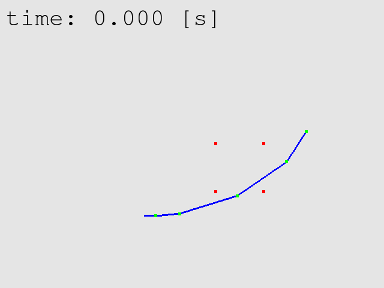

# milab@OsakaU - Smooth and Flexible Movement Control of a Robot Arm
This is the C implementation of [Smooth and Flexible Movement Control of a Robot Arm](https://kagaminccino.github.io/project/robotarm/).

We improved a nonlinear reference shaping controller for manipulators sharing their workspace with humans. The controller is based on the slow and rapid adaptations, which we tried to enhance. After the progress, the slow adaptation can generate movements with smooth endpoint velocity profiles when target position is changed. The rapid adaptation is upgraded as well with respect to not only significantly large external forces but also slight ones. They make the manipulators capable of behaving compliantly to the external forces, and also resuming the motion after the forces are removed, even when the shifts are small. Force detectors are unnecessary in this control system. The validity of the proposed ideas was confirmed via simulations on a planar 4-DOF manipulator.

Parameters of the arm can be adjusted by modifying `assignment.c`.  
In each folder exists an `execute.sh` file, use this to compile the arm. It creates .dat files and .png files.  
You can use .plt files with gnuplot and eps.sh (skip if not exist) to plot .dat files into .eps files.  
`make_video.sh` can help make .png files into .mp4 and .gif files of the animation of the arm simulation.
